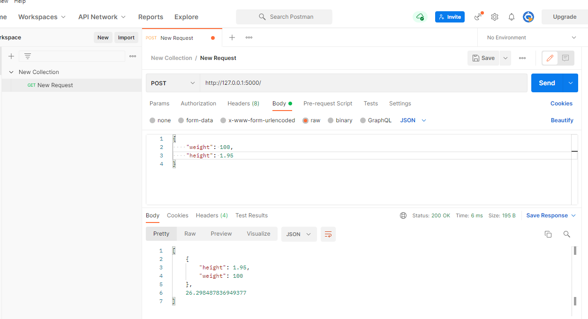

### Flask-app 
Short project to familiarize with Flask and local testing on Postman.

- Write a toy script in python (bmicalc.py)
- Write a Flask script to serve as interface between toy function and user request (flaskapp.py)
- Test the app (bmicalc.py & flaskapp.py) on Postman

_____________

