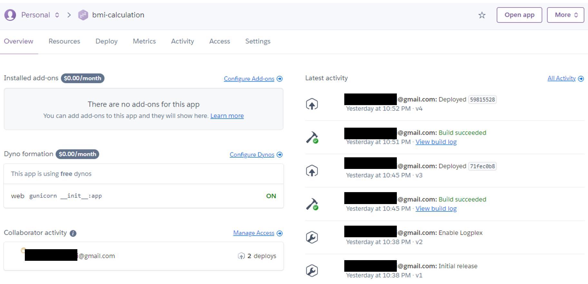
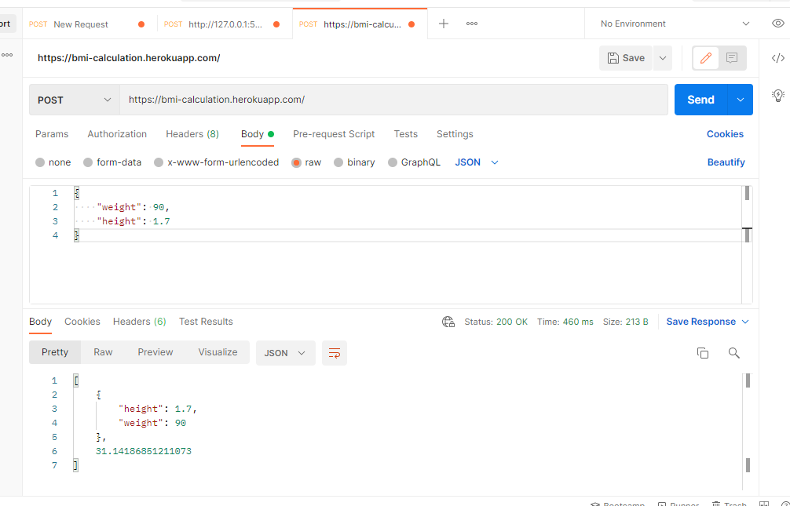

### Flask-heroku
Short project to further familiarize with Flask and testing on Heroku.

- Write/re-use python toy script from flask-app/ (bmicalc.py)
- Write/re-use a Flask script to serve as interface between toy function and user request (flaskapp.py)
- Deploy app on Heroku
- Test the deploy app (bmicalc.py & flaskapp.py) on Postman

_____________
```
Heroku deployment
```



```
Postman test
```
