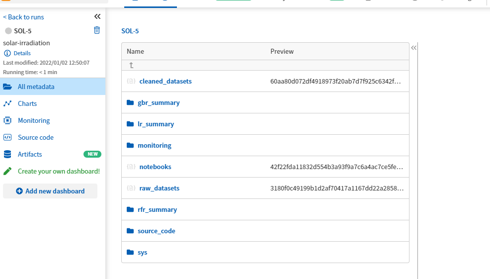
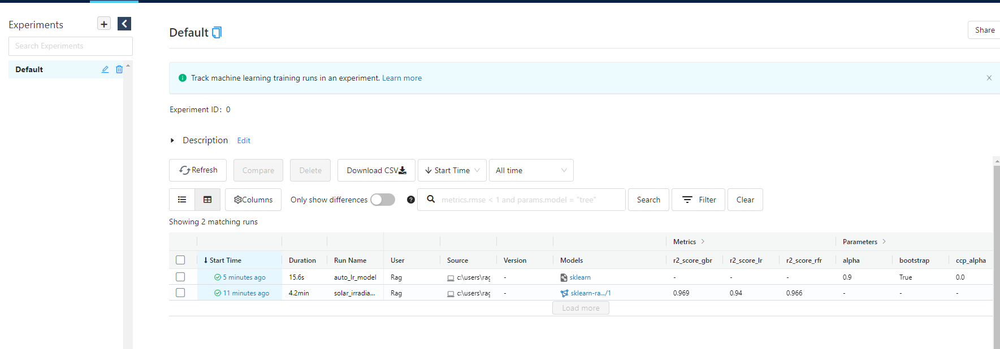
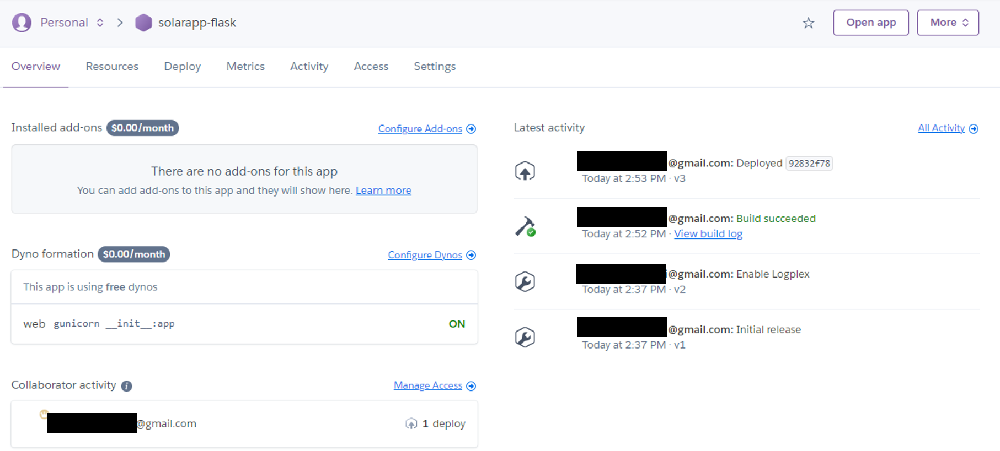
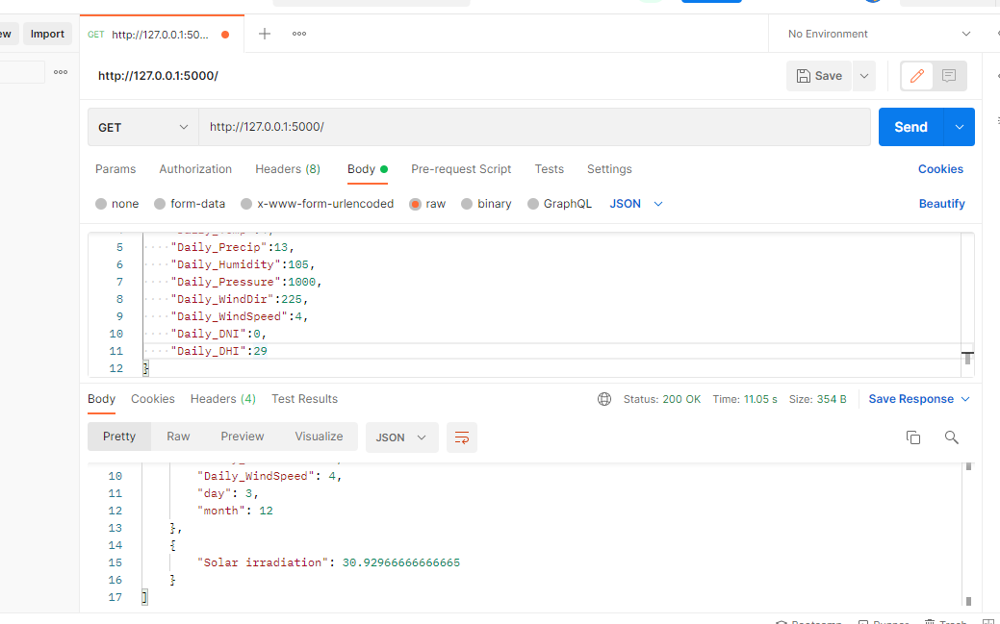

### solar-app-project
End-to-end project to predict solar irradiation for the city of Kraainem, Belgium.

- Download raw data from [solar cast website](https://solcast.com/): dates, irradiation, weather conditions, etc.
- Clean and format data into [data_cleaning notebook](notebooks/data_cleaning_sr.ipynb)
- Explore and visualize cleaned data into [data_exp_and_vis notebook](notebooks/data_exp_and_vis_sr.ipynb)
- Train and evaluate machine learning models into [model_dev notebook](notebooks/model_dev_sr.ipynb)
- Select and validate best performin model, deploy and monitor performance on neptune.ai and mlflow.org, into [model_val notebook](notebooks/model_val_sr.ipynb)
- Deploy the app (api + model) on heroku
- Test the deployed app on Postman

____________
```
Neptune monitoring
```



```
Mlflow monitoring
```



```
Heroku deployment
```



```
Postman test
```

